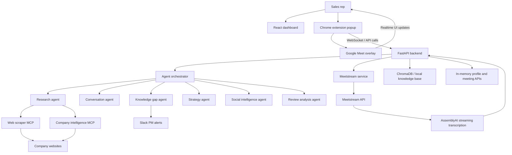
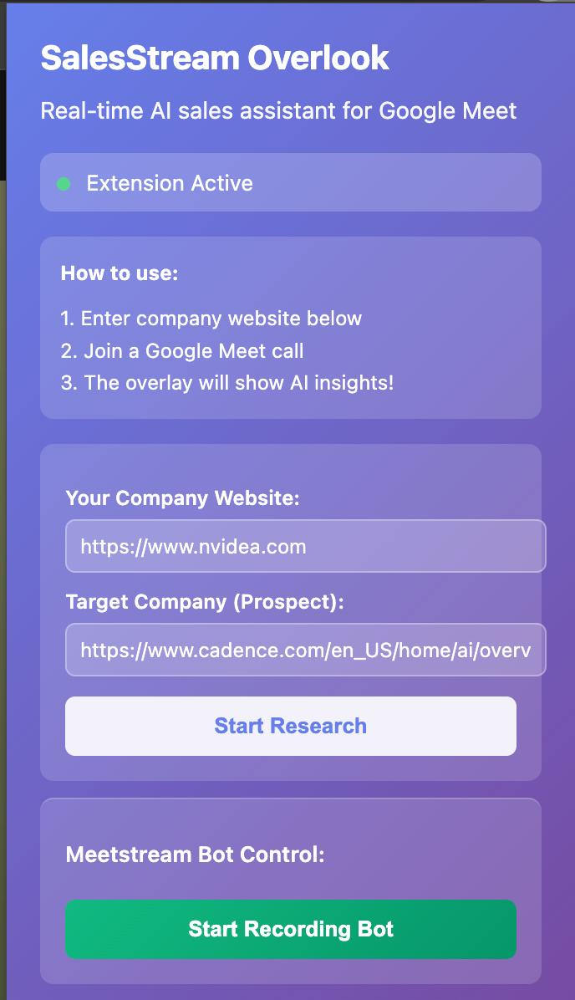
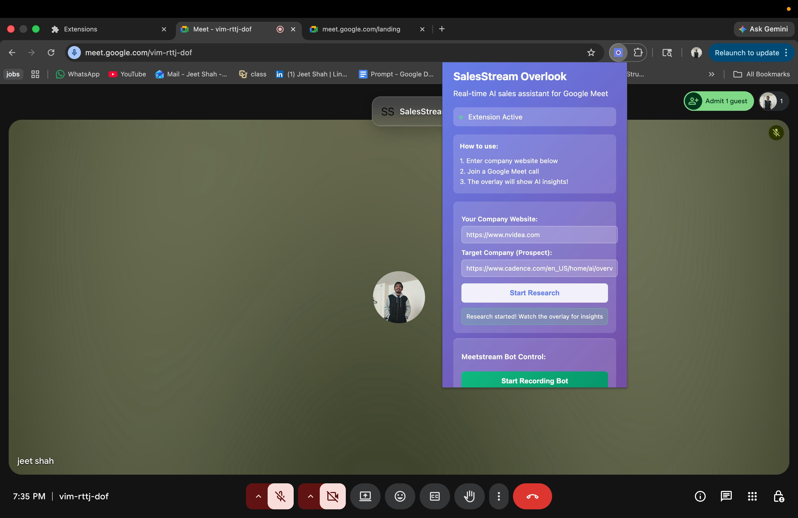
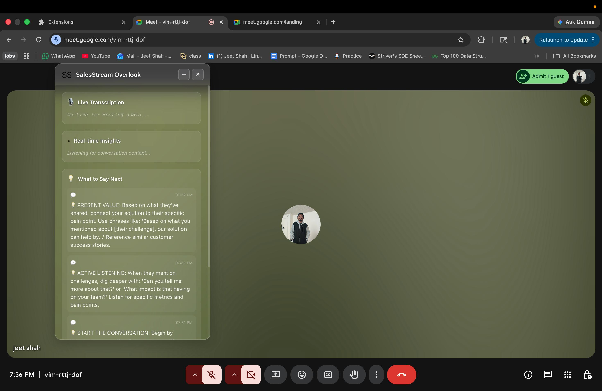
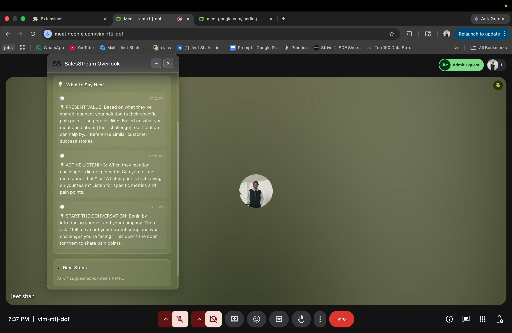

# Sales Copilot

Sales Copilot is a hackathon-built AI sales intelligence system that combines a React dashboard, a FastAPI backend, and a Chrome extension overlay for Google Meet. It is designed to help a sales rep research a prospect before the call, receive live coaching during the call, detect knowledge gaps in real time, and escalate critical questions to product stakeholders when needed.

This repository contains the imported `MeetStream-AI-Hackathon` codebase with a fresh git history, plus the screenshot assets in [`Images/`](Images).

## What the project does

- Pre-call research on a prospect company using website scraping and AI summarization
- Product-to-prospect matching by comparing your company site against the target company site
- Live Google Meet overlay with transcript, insights, suggested responses, and next steps
- Meetstream bot control for joining a meeting and forwarding live transcripts
- Knowledge-gap detection that can notify a PM team in Slack for urgent product questions
- Local RAG/knowledge-base support using ChromaDB for reusable product intelligence

## System Design



## Architecture Breakdown

### 1. Frontend dashboard

The `frontend/` app is a Vite-based React application that gives the rep a lightweight prep workspace:

- Login flow with regular email/password UX plus Scalekit SSO hooks
- Dashboard for quick actions and recent activity
- Profile setup page for the seller's company details
- Meeting prep form for prospect and company inputs
- Past meetings view backed by browser storage for demo persistence

The dashboard is useful as a prep surface, but parts of it are still prototype-grade. Some screens rely on `localStorage`, mock stats, and simulated insights rather than a fully persistent production backend.

### 2. Backend orchestration

The `backend/` service is the core of the system. It exposes REST endpoints, a realtime WebSocket channel, authentication callbacks, and Meetstream webhook handling. The main responsibilities are:

- Accept company URLs from the extension or frontend
- Launch parallel research tasks through the agent orchestrator
- Broadcast agent progress and results back to connected clients
- Accept transcript updates and route them into realtime conversation analysis
- Manage Meetstream bot sessions and AssemblyAI streaming transcription
- Escalate high-risk knowledge gaps to Slack

### 3. Agent layer

The orchestrator loads six agent roles:

- `ResearchAgent`: scrapes company sites and generates a concise sales briefing
- `ConversationAgent`: analyzes live transcript snippets and suggests what to say next
- `KnowledgeGapAgent`: detects urgent unanswered product questions and scores urgency
- `StrategyAgent`: synthesizes findings into talking points, objection handlers, and next steps
- `SocialIntelligenceAgent`: currently a placeholder-oriented social research layer
- `ReviewAnalysisAgent`: currently a placeholder/template layer for review-site intelligence

The most complete paths in code are company website research, realtime transcript handling, overlay updates, and the knowledge-gap escalation flow.

### 4. Browser extension

The `salesstream-extension/` Chrome extension is the in-meeting user experience:

- Popup for entering your company URL and the prospect's company URL
- Button to start research before or during a meeting
- Button to spawn the Meetstream recording/transcription bot
- Content script that injects a draggable glassmorphism overlay into Google Meet
- Overlay sections for live transcription, realtime insights, suggested responses, and next steps

### 5. Intelligence and data services

The backend also includes:

- `web_scraper_mcp` for crawling and extracting website content
- `company_intelligence_mcp` for richer company analysis and comparisons
- `rag_service.py` plus local Chroma storage for knowledge-base search
- transcript storage helpers and a bundled sample product knowledge base

## Screenshots

<table>
  <tr>
    <td width="50%">
      
      <p><strong>Extension popup:</strong> the rep enters their own company site and the target company site, then kicks off AI research directly from Chrome.</p>
    </td>
    <td width="50%">
      
      <p><strong>Popup inside Google Meet:</strong> the workflow is designed to stay close to the live meeting so the rep can start research without switching tools.</p>
    </td>
  </tr>
  <tr>
    <td width="50%">
      
      <p><strong>Live overlay:</strong> the in-meeting panel surfaces transcription, realtime context, and AI-generated guidance while the call is happening.</p>
    </td>
    <td width="50%">
      
      <p><strong>Coaching panel:</strong> the overlay expands into specific talk tracks, response suggestions, and next-step prompts for the seller.</p>
    </td>
  </tr>
</table>

## End-to-end flow

1. The seller opens the extension popup and provides company URLs.
2. The extension sends a `start_research` message over WebSocket to the FastAPI backend.
3. The agent orchestrator runs company research in parallel and streams results back to the overlay.
4. If the seller starts the Meetstream bot, the backend asks Meetstream to join the Google Meet call.
5. Meetstream audio is transcribed through AssemblyAI and transcript events are routed back into the backend.
6. The conversation agent analyzes each transcript chunk and generates live coaching.
7. The knowledge-gap agent checks whether a prospect question is both important and under-answered.
8. If the urgency is high, the backend can notify Slack and return PM guidance to the rep in the overlay.
9. The strategy layer consolidates findings into battle-card style recommendations and next steps.

## Repository structure

```text
.
├── backend/
│   ├── agents/                  # AI agent implementations
│   ├── api/                     # Company intelligence endpoints
│   ├── mcp_servers/             # Website scraping and intelligence MCP services
│   ├── services/                # OpenAI, Meetstream, AssemblyAI, Slack, RAG, auth
│   ├── data/                    # Product knowledge base seed data
│   ├── chroma_db/               # Local vector store files
│   ├── transcripts.db           # Local SQLite transcript store
│   └── main.py                  # FastAPI app entrypoint
├── frontend/                    # React + Vite prep dashboard
├── salesstream-extension/       # Chrome extension for Google Meet
├── Images/                      # Provided screenshots for the README
├── ARCHITECTURE_DIAGRAM.txt     # Detailed architecture notes
├── COMPLETE_SYSTEM_GUIDE.md     # Expanded system walkthrough
├── CODEBASE_MAP.md              # Codebase-level navigation doc
└── start-all.sh                 # Convenience startup script
```

## Tech stack

- Frontend: React, Vite, React Router, Tailwind, Heroicons, Axios
- Backend: FastAPI, WebSockets, Python async services
- AI: OpenAI `gpt-4o` wrappers plus agent-based prompting
- Realtime transcription: Meetstream + AssemblyAI Streaming
- Research: Playwright/BeautifulSoup scraping through MCP-style services
- Auth: Scalekit SSO integration hooks
- Storage: local in-memory APIs, SQLite transcript file, ChromaDB vector store
- Collaboration/escalation: Slack bot integration for PM support

## Current status

What is implemented well:

- Core backend service scaffolding
- Realtime WebSocket messaging between backend and extension
- Website research and company-intelligence flows
- Google Meet overlay UX
- Meetstream bot-start flow and AssemblyAI transcription plumbing
- Knowledge-gap detection and Slack escalation scaffolding

What is still hackathon/prototype quality:

- Several frontend screens use demo data or browser storage
- LinkedIn/social intelligence is partially mocked
- Review analysis is mostly templated rather than live-scraped
- External integrations depend on local credentials and service availability
- Some docs in the original repo describe future-state capabilities that are only partially wired in code

## Getting started

### Backend

```bash
cd backend
cp .env.example .env
./start.sh
```

Important environment variables:

- `OPENAI_API_KEY`
- `MEETSTREAM_API_KEY`
- `MEETSTREAM_WEBHOOK_SECRET`
- `ASSEMBLYAI_API_KEY`
- `SCALEKIT_CLIENT_ID`
- `SCALEKIT_CLIENT_SECRET`
- `SCALEKIT_ENVIRONMENT_URL`
- `SLACK_BOT_TOKEN`
- `SLACK_SIGNING_SECRET`
- `SLACK_PM_CHANNEL_ID`
- `APIFY_TOKEN`

### Frontend

```bash
cd frontend
npm install
npm run dev
```

### Extension

1. Open `chrome://extensions/`
2. Enable Developer Mode
3. Click `Load unpacked`
4. Select `salesstream-extension/`
5. Join a Google Meet call and use the extension popup

## Useful docs in this repo

- [`ARCHITECTURE_DIAGRAM.txt`](ARCHITECTURE_DIAGRAM.txt)
- [`COMPLETE_SYSTEM_GUIDE.md`](COMPLETE_SYSTEM_GUIDE.md)
- [`CODEBASE_MAP.md`](CODEBASE_MAP.md)
- [`PRODUCT_NEED_MATCHING_GUIDE.md`](PRODUCT_NEED_MATCHING_GUIDE.md)
- [`SLACK_PM_INTEGRATION_README.md`](SLACK_PM_INTEGRATION_README.md)

## Summary

Sales Copilot is best understood as a working hackathon prototype for realtime AI-assisted sales calls. Its strongest story is the combination of prospect research, live in-meeting coaching, transcript-driven assistance, and PM escalation when the rep gets asked something critical they cannot confidently answer on the spot.
